## 😄 Hi, I am Jyotika Bhatia
## Languages & Tools 💻

---

## **Data Science | Python | SQL/Tableau| Machine Learning**

I’m a data enthusiast driven by curiosity for transforming raw data into meaningful insights.  
I enjoy working with **Python, SQL, data visualization, and ML models** to turn datasets into decisions.  
In addition, I'm experienced in **financial services industry**.  

🔎✨ Currently, improving my knowledge in **Generative AI for Data Science**. 

Based in Noida, Uttar Pradesh, IN. 

---

## Featured Projects 

**RAG-Based AI Assistant**  
🔗 **Project Repository:** https://github.com/Volt2608/RAG_Based_AI_Assistant

**Project Output -**
This project builds a Retrieval-Augmented Generation (RAG) AI assistant that helps students explore MIT OpenCourseWare Python lectures. Instead of guessing, the system retrieves exact lecture segments with timestamps and generates answers grounded strictly in course content.

**Project Workflow -** 
The pipeline converts lecture videos to audio, transcribes them using Whisper, chunks and embeds the text with Ollama, and performs semantic similarity search to retrieve relevant segments. A lightweight LLM then produces accurate, context-aware responses or clearly refuses to answer if the question is out of scope.

This project demonstrates an end-to-end RAG workflow on unstructured data, focusing on deterministic pipelines, grounded generation, and explainable outputs.

**Tech Stack -** Python, Whisper, Ollama, Scikit-learn, Jupyter

----------------------------------------------------------------------------------------------------------------------------------------------------------

🏠 **California Housing Price Prediction**         
🔗 **Project Repository:** https://github.com/Volt2608/CaliforniaHousingPrice

**Project Output -**
This project predicts median house prices in California using demographic, geographic, and economic features. It focuses on building a **robust end-to-end machine learning pipeline** rather than just model training.

**Project Workflow -** 
The workflow includes data cleaning, exploratory data analysis, feature engineering, stratified sampling, and preprocessing using Scikit-learn pipelines and ColumnTransformer. Multiple regression models are trained and evaluated to compare performance and generalization.

The project demonstrates strong fundamentals in **data preprocessing, model evaluation, and reproducible ML workflows** suitable for real-world applications.

**Tech Stack -** Python, Pandas, NumPy, Scikit-learn, Matplotlib

---

> *“Inspiration :*
> 
> *“What we have to learn to do, we learn by doing.”*  
> — Aristotle
> 
---

## Quick Fun Fact 

## 🌐 Connect With Me

