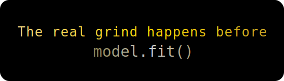

##  Hi, I am Jyotika Bhatia! 👋🏼 😁

I’m a Data Scientist driven by curiosity for transforming raw data into meaningful insights. 

I enjoy working with **Python, SQL, data visualization, and ML models** to turn datasets into decisions.  
In addition, I'm experienced in **financial services industry**.  

🔎✨ Currently, improving my knowledge in **Generative and Agentic AI for Data Science**. 

Based in Noida, Uttar Pradesh, IN. 
### Languages & Tools 💻

---

### **LLM | Retrieval-Augmented Generation  | Machine Learning | SQL | Python**

---

## 🚀 Featured Project

### 🔹 Churn Risk Intelligence System
An end-to-end machine learning system designed to predict customer churn risk and provide actionable business insights through explainability and simulation.

- 📊 Built a complete ML pipeline (data preprocessing → model training → evaluation)
- 🎯 Predicts customer churn probability with a risk scoring system (0–100)
- 🔍 Integrated SHAP for model explainability and feature impact analysis
- 🖥️ Developed an interactive dashboard using Streamlit
- 🔄 Implemented a simulation engine to test customer retention strategies
- 💡 Focused on real-world business impact: churn reduction & decision support

**Tech Stack:** Python, Pandas, NumPy, Scikit-learn, SHAP, Streamlit  

🔗 [View Project](https://github.com/Volt2608/Churn_Risk_Intelligence_System)

---

### 🔹 RAG-Based AI Assistant
An end-to-end Retrieval-Augmented Generation (RAG) system designed to answer queries based on MIT OpenCourseWare Python lectures with grounded, context-aware responses.

- 🎯 Retrieves relevant lecture segments with timestamps for accurate answers  
- 🔍 Converts video → audio → text using Whisper for processing  
- 🧠 Performs semantic search using embeddings generated via Ollama  
- 💬 Generates responses using a lightweight LLM with strict context grounding  
- 🚫 Handles out-of-scope queries by refusing incorrect answers  

**Tech Stack:** Python, Whisper, Ollama, Scikit-learn, Jupyter  

🔗 [View Project](https://github.com/Volt2608/RAG_Based_AI_Assistant)

---

### 🔹 California Housing Price Prediction
An end-to-end machine learning project focused on predicting median house prices using demographic and geographic data.

- 📊 Built a complete ML pipeline (data cleaning → preprocessing → model training)  
- 📈 Applied stratified sampling for balanced dataset splitting  
- 🧹 Performed feature engineering and data preprocessing using pipelines  
- 🤖 Trained and evaluated multiple regression models  
- 📉 Focused on model performance and generalization  

**Tech Stack:** Python, Pandas, NumPy, Scikit-learn, Matplotlib  

🔗 [View Project](https://github.com/Volt2608/CaliforniaHousingPrice)

---

> *“Inspiration :*
> 
> *“What we have to learn to do, we learn by doing.”*  
> — Aristotle
> 
---

## Quick Fun Fact 

## 🌐 Connect With Me

